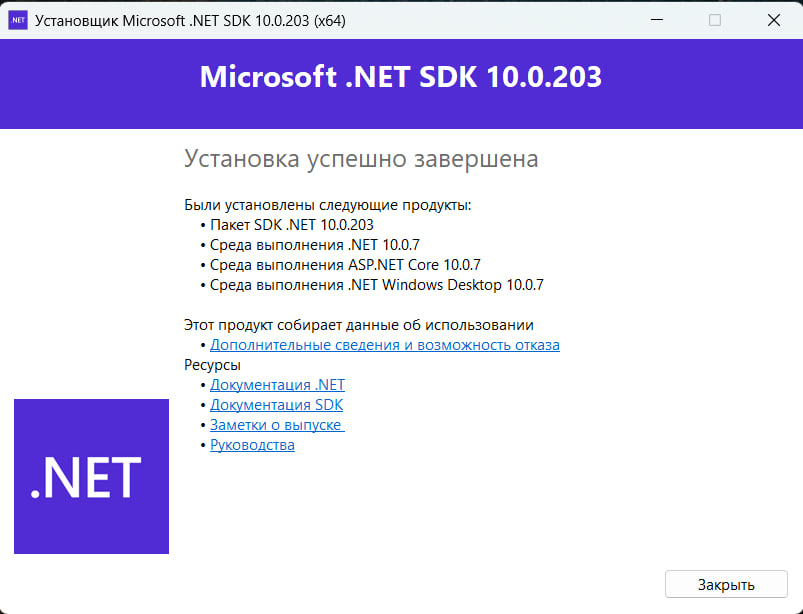
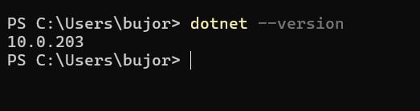
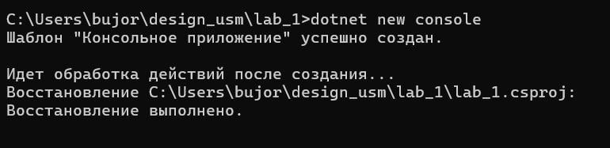
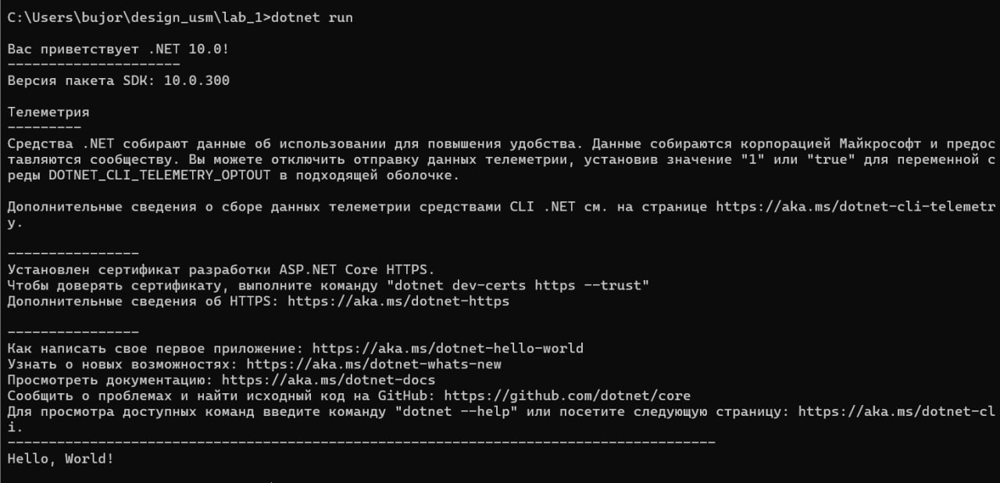

# Лабораторная работа №1

**Тема:** Установка и настройка среды разработки .NET.

## Задания и выполнение

### 1. Установка .NET
Установил пакет SDK .NET на локальный компьютер для разработки кроссплатформенных приложений.

### 2. Проверка установки
Открыл терминал и убедился, что команда `dotnet` доступна в системе и отображает текущую версию.

### 3. Создание проекта
Инициализировал новый C# проект типа Console Application через командную строку.

### 4. Запуск приложения
Скомпилировал исходный код и запустил программу с помощью команды `dotnet run`. Программа успешно вывела результат в консоль.

